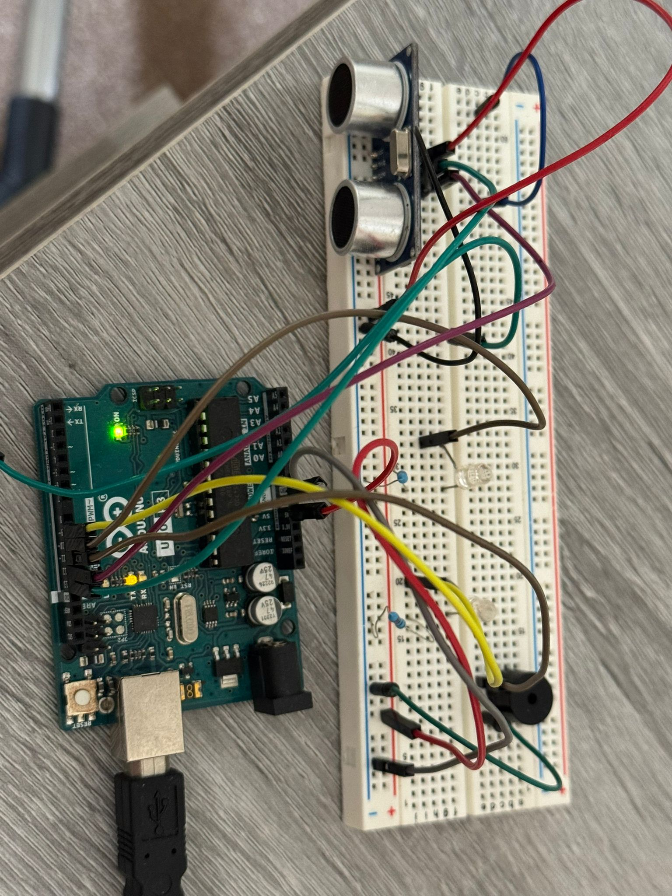
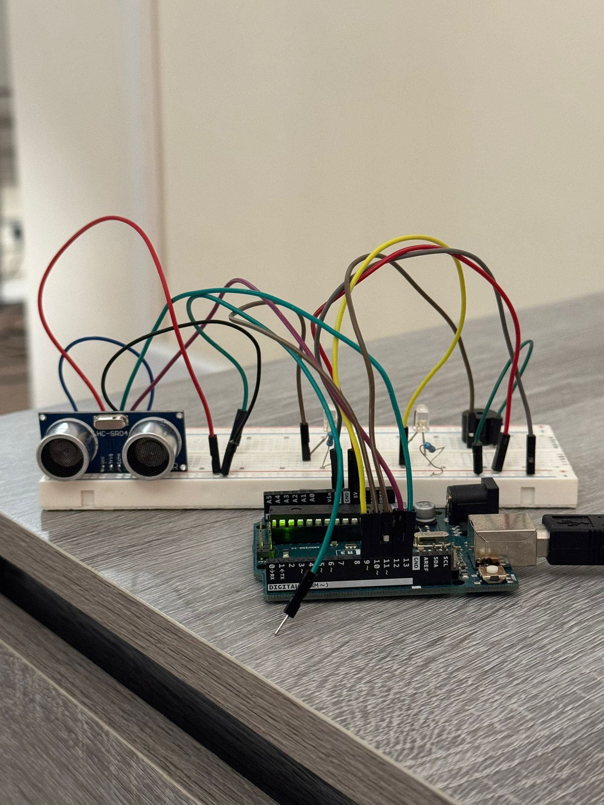
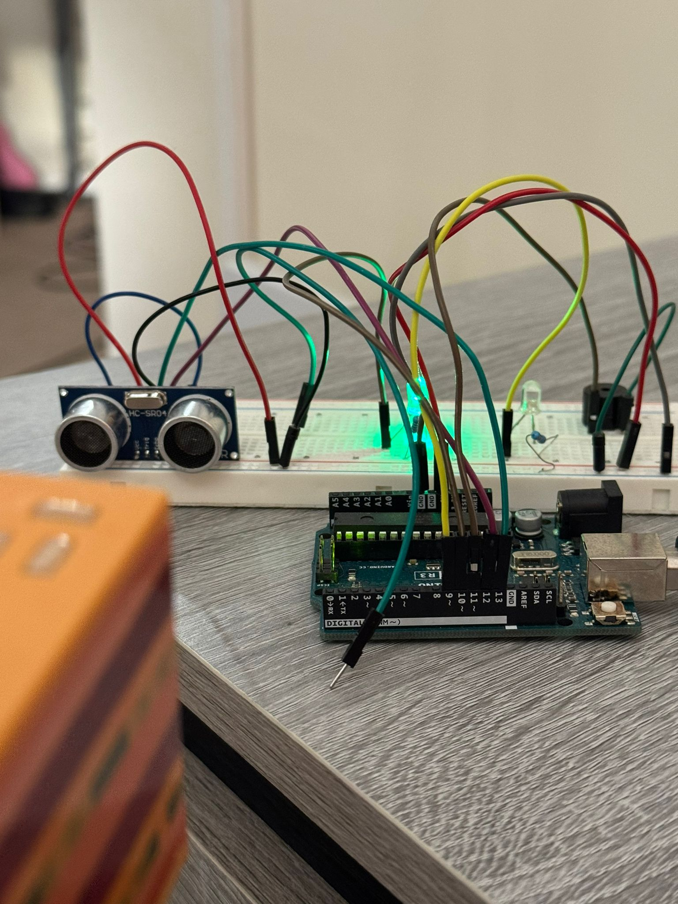
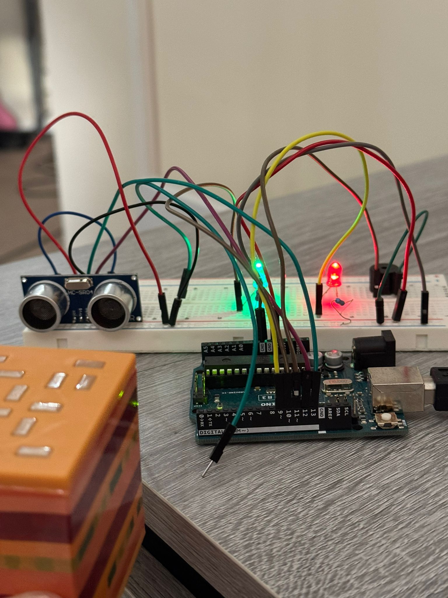

````markdown
# Distance Sensor with Arduino and Python

This project combines an Arduino and an HC-SR04 ultrasonic sensor to measure real-time distance. Readings are sent over serial to a Python script, which interprets the data and gives visual and audio feedback using LEDs and a buzzer.

---

## Features

- Live distance readings (in cm)
- LED indicators for proximity alerts (green = safe, red = too close)
- Buzzer triggers when an object is very near
- Python script reads and filters serial data
- Easily extendable for logging, plotting, or GUI dashboards

---

## Hardware Used

- Arduino Uno / Nano  
- HC-SR04 Ultrasonic Sensor  
- Green LED  
- Red LED  
- Active Piezo Buzzer  
- Resistors, Breadboard, Jumper Wires

---

## Software Used

- Arduino IDE  
- Python 3.13+  
- Python library: `pyserial`

---

## How to Use

1. Upload `distance_reader.ino` to your Arduino  
2. Wire up the circuit (see below for example images)  
3. Install Python dependencies:


pip install pyserial


4. Edit the COM port and run the Python script:


PORT = 'COM4'  # Change to match your setup
python distance_reader.py


---

## File Structure

```
distance-sensor-python/
├── distance_reader.ino       # Arduino code
├── distance_reader.py        # Python script
├── README.md                 # This file
├── *.png / *.jpg             # Circuit and output images
```

---

## Preview

Example wiring and output screenshots:







---

## Notes

- Sensor values above 400 cm are ignored to filter noise
- Arduino sends JSON-formatted serial data for easy parsing
- Thresholds for LED and buzzer activation can be adjusted in the `.ino` code

---

## Planned Upgrades

- Live plotting with matplotlib  
- GUI interface using Tkinter or PyQt  
- CSV data logging  
- Automatic serial port detection  

---

## Author

**Enio Mecaj**  
Feel free to use, share, or build on this project.
````


